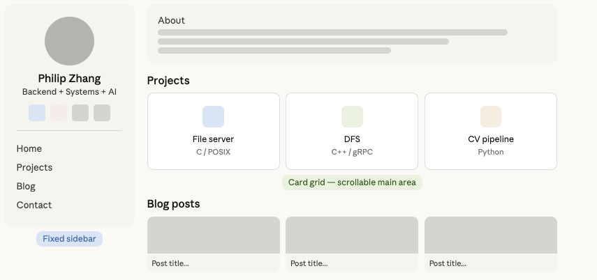

# Personal Portfolio Website — Project Reference

---

## 1. Strategic Context

### Time Budget
- **Ship the MVP in 2-3 days. Do not over-invest.**
- Use AI tools to scaffold the initial site fast.
- Then fill it with real content over the coming months as projects are completed.

### What It Is NOT
- Not a multi-week design project.
- Not a content empire platform (YouTube, blog network).
- Not a stock analysis SaaS frontend (that's a separate project, potentially at a subdomain later).

---

## 2. Recommended Tech Stack

| Component | Choice | Reason |
|---|---|---|
| **Domain** | `philipzhang.dev` or `zhipengzhang.dev` (check availability) | `.dev` TLD signals software engineer. ~$12/year. |
| **Registrar** | Namecheap, Cloudflare, or Google Domains | Buy domain here, point DNS to Vercel. |
| **Hosting** | Vercel (free tier) | Zero cost, auto-deploys from GitHub, handles HTTPS automatically. |
| **Framework** | Static site generator (Hugo or 11ty) | Blog requires Markdown-to-HTML rendering at build time. SSG handles this automatically. Still outputs plain static files — no runtime server needed. |
| **Repo** | Public GitHub repo | The site itself becomes a portfolio artifact (recruiters can see your code). |

### Why Own Domain + Vercel (Not Just Vercel Free URL)?
- `philipzhang.dev` looks professional and intentional.
- `philip-zhang-portfolio.vercel.app` looks like a student project.
- Domain and hosting are separate decisions: buy the domain, host free on Vercel, get the best of both.
- Own domain enables future subdomains: `stocks.philipzhang.dev` for the stock analysis dashboard, etc.

### Hosting Platform (Decided)
- **Vercel (free tier / or similar platform)** — recommended. Auto-deploys from GitHub, HTTPS, CDN.
- Templates/sites are NOT tightly coupled to the hosting platform. A static site outputs plain HTML/CSS/JS and can be deployed to any platform (Vercel, Netlify, GitHub Pages, Cloudflare Pages) with zero code changes.

### Layout (Decided: Sidebar + Main Content)

Inspired by 月球大叔's portfolio template on Rednote. The layout uses a **fixed sidebar on the left** (profile card with avatar, name, tagline, social links, navigation, resume download) and a **scrollable main content area on the right** (About → Projects card grid → Blog → Footer).

- CSS implementation: `display: flex` with sidebar `width: 260px; position: sticky` and main `flex: 1`.
- Mobile: sidebar stacks above main content, project grid collapses to single column.
- Light theme, white background, English only.

### Blog Feature (Decided: In MVP, Markdown-based)

Blog is a core feature from day one. Write posts as `.md` files in a `/blog` or `/posts` directory → `git push` → SSG (Hugo or 11ty) converts Markdown to HTML during build → Vercel auto-deploys. This is the standard approach for developer blogs (Approach 2: Static Site Generator).

Blog posts will appear as thumbnail cards in the main content area, linking to individual post pages generated from Markdown files.

---

## 3. Site Content & Structure

### MVP 

A clean single-page site with:

- **About Me** — brief intro, your positioning (backend + systems + AI engineering), MSCS @ Georgia Tech in progress.
- **Projects section** — each project gets a card with title, short description, tech stack tags, and link to GitHub repo.
- **Blog section** — Markdown-based blog with SSG (Hugo or 11ty). Write `.md` files, auto-rendered to HTML on deploy.
- **Resume** — PDF download link.
- **Links** — GitHub, LinkedIn, email.
- **Mobile responsive** — must work on phone screens.

### Projects to Feature (in order of priority)

1. **Multithreaded File Server & Client (C/POSIX)** — thread-pool, bounded queue, hardened TCP/IP I/O, GDB/Valgrind.
2. **Distributed File System (C++14/gRPC)** — write-lock coordination, weakly consistent cache, inotify-based sync.
3. **Computer Vision Insect Detection Pipeline (Python/PyTorch)** — pre-trained model integration, inference pipeline, fine-tuning. (Keep even though it's prototype stage; it's a real project with a real client.)
4. **Stock Analysis Automation Agent** (once built) — market data pipeline, LLM-based analysis, scheduled push to Discord/email.
5. **HAO Brands Backend Work** — brief description of production microservices, latency optimization (3s→0.3s), Docker/CI/CD. (No GitHub link since it's proprietary, but describe the work.)

### GT MSCS Projects — Honor Code Constraint
- Source code for GT MSCS coursework (e.g., Multithreaded File Server, Distributed File System) **cannot be made public** on GitHub. Publishing it would violate the Georgia Tech Honor Code.
- **Workaround:** Create a separate public repo for each project with a comprehensive README that demonstrates design thinking, architecture decisions, tradeoffs, and key learnings — without exposing the actual source code. This shows recruiters how you think, not just that you completed an assignment.

### Content Growth Plan (Ongoing)

The site grows as you complete projects:

| Timeline | Content to Add |
|---|---|
| Weekend 1-2 | MVP: about, existing projects, blog (SSG + Markdown), resume, links |
| Month 1-2 | Stock analysis agent project card (once MVP is built) |
| Month 2-3 | Insect CV project update (after client feedback + fine-tuning round) |
| Month 3-6 | Blog post(s) about project architecture decisions (if still job searching) |
| Month 6+ | Additional projects, deeper write-ups |

---

## 4. Design Principles

- **Clean and simple.** No flashy animations, no dark mode toggle, no particle.js background.
- **Substance over style.** Every section should contain real, demonstrable work. Empty sections are worse than no sections.
- **Professional tone.** English-language site (your target employers are US companies). Brief, clear descriptions.
- **Fast loading.** Static HTML/CSS loads instantly. No heavy JavaScript frameworks needed.

---

## 5. Build Approach (Executed)

1. Used 月球大叔's Rednote portfolio as layout reference.
2. Fed the screenshot + project reference to Claude. Generated an initial `index.html` with sidebar + card grid layout as a design prototype.
3. **Next steps:** Set up SSG (Hugo or 11ty) with the sidebar + card grid layout, configure Markdown blog pipeline, customize URLs/links/email, add resume PDF, push to GitHub, connect to Vercel, connect custom domain.
4. Done. Move on to job applications.

---

## 6. Still To Be Decided (Future Session)

- [ ] Check domain name availability (`philipzhang.dev`, alternatives)
- [x] Sidebar + main content layout, using SSG (Hugo or 11ty)
- [x] Sidebar (profile) | Main (About → Projects → Blog → Footer)
- [x] Blog in MVP, Markdown-based via SSG
- [x] Bilingual support (English primary, Chinese optional)
- [ ] Choose SSG: Hugo vs 11ty (to be decided before build starts)

- [ ] SEO basics (meta tags, Open Graph for link previews) — basic meta tags already in the HTML scaffold
